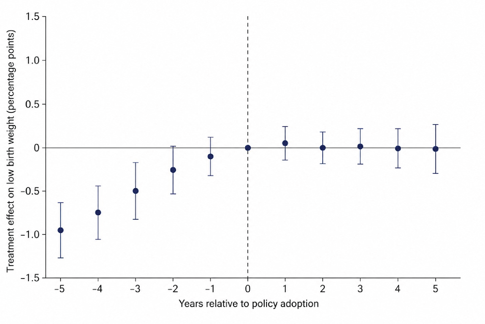

Welcome to the second exam of PHS2000B! As a reminder, you should complete and upload your exam to the Assignments tab on Canvas according to the schedule that you requested. You do not need to have Canvas open during the exam -- just download the PDF file and upload your responses once you are done.

**This exam has 4 sections, including a total of 43 points.**

You may refer to your notes, problem set solutions and code, and any books you would like, but please do not discuss the exam with any other students from class or your tutor. By submitting this exam, you affirm that the work is yours alone and that you have not discussed the questions or responses with anyone other than the instructional team. By submitting this assignment, you also affirm that you did not use generative AI while completing this exam. Since the exam will be administered over several days, no discussion of the exam is permitted (other than with the instructional team) until all students have submitted their exam.

If you have clarifying questions for the instructional team, please email the whole team (well, Jarvis and Maggie) and we will get back to you as soon as possible. Please note that there is no class time devoted to working on this exam in person since the dates are so spread out.

There is a [Google doc](https://docs.google.com/document/d/17gb-jd-fKaKVj8J0mlyh0lRmi5S71p88YNKrc11dBn4/edit?usp=sharing) where we will be posting any clarifications that arise from questions we receive during the exam. If we post a clarification, we will also post an Announcement referring you to the Google doc. Please note that any math or drawings you want to include can be typeset into the document or can be pasted in as an image. You are not required to typeset the math. Good luck!

\newpage

# Part 1: Instrumental Variable Analysis (12 points)

Dr. Nahar is interested estimating the effect of exposure to insecticides during the first trimester of pregnancy on low birthweight. There is no data on these exposures from trials, so research designs have relied on observational data which have limitations since geographic areas with more exposure to insecticides are different from each other in many confounding ways. 

One day Dr. Nahar realizes that there is a natural exogenous phenomenon – cicadas – that may provide a way of estimating the causal effect of insecticide exposure on birthweight. Cicadas are insects that lay dormant underground and emerge every 13 or 17 years depending on the specific lineage. Once development is complete, they emerge all at the same time. There are different "broods" or cohorts that are specific to different regions of the United States, and they predictably emerge above ground every 13 or 17 years in extreme numbers, and feed on the stems of woody trees (e.g. apple trees). When cicadas emerge, the use of insecticides increases dramatically in affected areas. Dr. Nahar believes that she can use this phenomenon as an instrument to study the effect of insecticides on low-birth-weight among mothers whose first trimester overlapped with cicada emergence.

You have data on insecticide use and proportion of births that are low birthweight (LBW) at the county level, by month. You use this to calculate the average use of insecticides during county-months where cicadas emerged versus did not emerge. Similarly, you calculated the proportion of LBW births among pregnancies whose first trimester was exposed to cicada emergence versus those that were not exposed. These are summarized in the simple 2x2 tables below.

|                                 | Yes | No  |
|---------------------------------|-----|-----|
| Average insecticide use ($kg/m^2$) | 15  | 10  |
| Percentage of births that are LBW | 0.09 | 0.08 |

## Question 1: (2 pt)
What is the effect of cicada emergence on insecticide usage at the county level? 

## Question 2 (2 pt)
Estimate the effect of cicada emergence on the proportion of low birthweight (LBW) births at the county level, as a risk difference. What is the name of this effect in the IV context? 

## Question 3  (2 pts)
Estimate the effect of insecticide use on proportion of births that are LBW at the county level.

## Question 4 (4 pts)
Of the key assumptions for IV, which assumptions cannot be empirically verified? Discuss potential violations of the assumptions that might concern you in the context of this research design (no more than 150 words). 

## Question 5 (2 pt)
Suppose your favorite public health journal has asked for papers about the impact of insecticides and pesticides on health outcomes. Discuss how well your paper fits into this request in terms of its external validity (no more than 150 words). 

\newpage

# Part 2: Difference in Differences Analysis (8 points)

Dr. Zahar would like a broader estimate of the impact of insecticide use on birth outcomes for a broader set of insecticides. She asks a graduate student to investigate policy changes surrounding insecticide use at the state level. She discovers that Colorado, Arizona and New Mexico each passed a law in 2012 requiring that companies using insecticides were required to do a comprehensive scientific review of the evidence surrounding the impact of their insecticide formulations on pregnancy and birth outcomes. Dr. Zahar suggests to her graduate that comparing outcomes in these states before and after the policy change could be a potential dissertation paper. 

## Question 1 (2 pts)
If you were Dr. Zahar’s graduate student, what concerns might you have about this research design and what alternative could you suggest? Limit your response to 2-3 sentences. 

## Question 2 (2 pts)
Imagine that you suggest a difference in differences analysis incorporated states that did and did not pass the scientific review policy. Dr. Zahar contends that this analysis would be biased since states that didn’t implement the ban have better birth outcomes and less insecticide use on average compared to those that don’t. How would you respond? Limit your response to 2-3 sentences.  

## Question 3 (2 pts)
Imagine that you go ahead with running a difference in differences analysis and you are proud to create the following event study figure. Dr. Zahar is disappointed to see that you have estimated null treatment effects for the relationship between low birth weight and the policy change. How would you respond? What solutions could you propose? 

## Question 4 (2 pts)
Imagine that you discovered that 3 additional states (Texas, Nevada and Mississippi) had implemented similar policies in 2017, 2019 and 2020. How does this change your estimation strategy? Limit your response to 2-3 sentences. 

\newpage 

# Part 3: Regression Discontinuity Design (8 points)

Consider this paper (Eyting M, Xie M, Michalik F, Heß S, Chung S, Geldsetzer P. A natural experiment on the effect of herpes zoster vaccination on dementia. Nature. 2025 Apr 2. doi: 10.1038/s41586-025-08800-x. Epub ahead of print. PMID: 40175543.).  

## Question 1 (2 pt)
In the context of this regression discontinuity study, describe how the “running variable” and the cutoff are defined. What is the treatment in this context, and how well does it conform to the idea of a "sharp" or "fuzzy" RD? 

## Question 2 (2 pt)
What assumptions must this paper make that cannot be tested in order for RDD to be a valid causal inference strategy? 

## Question 3 (2 pt)
This study explores the relationship between herpes zoster vaccination and dementia outcomes. Suggest one possible alternative mechanism (other than the direct biological effect of the vaccine) that could explain the observed effect. How could the authors evaluate whether this alternative explanation plays a significant role? 

## Question 4 (2 pt)
Imagine that another country is considering introducing a vaccination with a different age cutoff (e.g., age 55 instead of 70). How much would you expect the results from this paper to translate to this other potential application?  

\newpage

# Part 4: Missing Data (15 points)

The following four questions ask you to reason about missing data mechanisms using directed acyclic graphs (DAGs). Each question presents a narrative description of a study, its variables, the circumstances under which data are missing, and the target association the investigators seek to estimate. For each question, you are asked to complete three tasks.

(a) Draw the DAG. Represent the structural relationships among all study variables — including the exposure ($A$), outcome ($Y$), measured covariates ($L_1, L_2,$ etc.), and the missingness indicator ($R$) for the partially observed variable — using a directed acyclic graph. You can assume that all important variables are explicitly named in the narrative and that there are no additional unmeasured covariates. Include all arrows implied by the narrative, and only those arrows. Note that you may draw your DAG by hand and embed it in your response or use Powerpoint or tikz.

(b) Identify the missing data mechanism. Using your DAG from part (a), state the conditional independence assumption for $R$ that characterizes the missing data mechanism as MCAR, MAR, or NMAR. Write a brief sentence to summarize your reasoning.

(c) Assess the viability of complete case analysis to estimate the target estimand stated in each question below. Using your DAG from part (a), identify the minimum conditioning set $\mathcal{C}$, if one exists, such that restricting the analysis to participants with complete data and fitting a linear regression of $Y$ on $A$ and $\mathcal{C}$ yields an unbiased estimate of your target estimand. State the variables in $\mathcal{C}$ if they exist, and justify your answer with reference to your DAG. If no sufficient conditioning set exists, explain why not. 

## Question 1 (2 points):

A randomized controlled trial (RCT) evaluates the effect randomization to a cognitive-behavioral therapy (CBT) program ($A$: CBT vs. waitlist control) on PTSD symptom severity as measured by PCL-5 score at 3-month followup ($Y$). Information on baseline PTSD severity ($L_1$: PCL-5 at enrollment) and treatment site ($L_2$) are fully observed. Some participants fail to complete the 3-month follow-up, resulting in missing $Y$. Clinical staff report that (i) participants randomized to the waitlist often disengage from study procedures, and (ii) those with more severe baseline symptoms are harder to retain. Among participants with the same treatment assignment and the same baseline severity, dropout does not further depend on what their actual 3-month PCL-5 score would have been. The investigators want to know if a complete case analysis using linear regression can be used to estimate $\mathbb{E}(Y^{a=1} - Y^{a=0})$. 

## Question 2 (2 points): 

A birth cohort study examines the effect of gestational diabetes ($A$: yes/no) on infant birthweight ($Y$: grams). Maternal age ($L_1$) and parity ($L_2$) are fully observed baseline covariates that we think are predictive of both gestational diabetes and infant birthweight. After data collection is complete, the research team discovers that birthweight measurements are missing for approximately 12% of infants. This occurred because a hospital information system migration randomly corrupted a subset of electronic records. The IT department confirms the corruption was triggered by a software bug unrelated to any patient characteristic, clinical variable, or study procedure. The investigators wish to know if a complete case analysis using linear regression can be used to estimate $\mathbb{E}(Y^{a=1} - Y^{a=0})$. You may assume no effect modification by covariates, such that the conditional and marginal effects of $A$ on $Y$ coincide. 

## Question 3 (2 points): 

A cross-sectional study examines the association between daily alcohol consumption ($A$: standard drinks/day, self-reported) and liver fibrosis stage ($Y$: continuous FibroScan score, measured objectively via imaging). Age ($L_1$) and sex ($L_2$) are fully observed and are assumed to be predictive of both daily alcohol consumption and liver fibrosis stage. Not all participants complete the alcohol questionnaire: some decline to answer. Clinicians and research staff note that older patients and those with objectively higher (worse) FibroScan scores — whose liver disease is visible and documented — are more likely to feel scrutinized and therefore refuse to disclose their drinking. However, among patients of the same age and with the same FibroScan score, the decision to disclose alcohol intake does not depend on how much the patient actually drinks. The investigators wish to know if a complete case analysis using linear regression can be used to estimate $\mathbb{E}(Y^{a} - Y^{a^*})$ where $a$ and $a^*$ are two levels of  drinks/day ($A$). You may assume no effect modification by covariates, such that the conditional and marginal effects of $A$ on $Y$ coincide. 

## Question 4 (2 points)
A prospective cohort study investigates the effect of social isolation ($A$: social network index score at baseline) on depression ($Y$: PHQ-9 score at 12-month follow-up). Baseline depression ($L_1$: PHQ-9 at enrollment) and age ($L_2$) are fully observed and are thought to be common causes of the social network index score at baseline and depression at 12 month followup. At the 12-month follow-up, some participants do not return to complete the PHQ-9 assessment. The research team reasons that participants who experience the most severe depressive symptoms at follow-up are the least likely to return: severe depression impairs motivation, energy, and capacity to engage with study activities. This remains true even among participants who have the same baseline depression score, age, and social isolation level. The investigators wish to know if a complete case analysis using linear regression can be used to estimate $\mathbb{E}(Y^{a} - Y^{a^*})$ where $a$ and $a^*$ are two levels of social network index score ($A$). You may assume no effect modification by covariates, such that the conditional and marginal effects of $A$ on $Y$ coincide. 

## Question 5

You have been asked to assist in the analysis of data from a 8-year prospective cohort study examining the association between adherence to the Mediterranean diet ($A$ = low vs. high adherence, dichotomized from a Mediterranean Diet Score derived from a validated food frequency questionnaire administered at baseline) and incident type 2 diabetes ($Y$ = 1 for year and $Y=0$ for no) ascertained via linked electronic health record at year 8. Age ($L_1$), sex/gender ($L_2$), and BMI at baseline ($L_3$) are full observed for all participants. Approximately 22% of participants did not return the baseline food frequency questionnaire, resulting in missing dietary adherence data for $A$. The study team has established that older participants and those with higher baseline BMI are more likely not to return the food frequency questionnaire, and that conditional on age and BMI, whether the FFQ is returned does not depend on the participant's actual diet quality.

The principal investigator has asked you to proceed with multiple imputation with chained equations (MICE) to recover the missing dietary data. You fit an imputation model that includes $L_1$, $L_2$, $L_3$, and $Y$ as predictors of $A$. You generate a total of 5 imputed dataets and fit a logistic regression model for the log odds of incident type 2 diabetes ($Y$) on Mediterranean diet adherence ($A$), controlling for age ($L_1$), sex/gender ($L_2$), and BMI ($L_3$) in each imputed dataset.

The table below reports the estimated $\beta$ and associated standard error for the diet adherence from each imputed dataset.

| Imputed Dataset (m) | $\hat{\beta}$ for $A$ | $\widehat{SE}(\hat{\beta})$ |
|:---------------------:|:----------------------------:|:------------:|
| 1 | 0.56 | 0.16 |
| 2 | 0.64 | 0.18 |
| 3 | 0.48 | 0.15 |
| 4 | 0.60 | 0.17 |
| 5 | 0.52 | 0.16 |

(a) Calculate the pooled $\hat{\beta}$ and $\widehat{SE}(\beta)$ across the imputed datasets. Please show your calculations. (4 points)

(b) Write a sentence appropriate for the results section of a scientific manuscript interpreting the pooled association of Mediterranean diet adherence with incident type 2 diabetes after 8 years of followup. Be sure to report this on an epidemiologically meaningful scale and include the 95% confidence interval for this association. (3 points)

\color{black}

